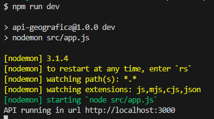

# APP GEOGRAFICA

El presente proyecto se conforma de 3 puntos/aspectos principales, entre los cuales se encuentran analizar datos geograficos con el uso de tecnologias GIS, como tambien desarrollar una aplicacion web que permita visualizar las ubicaciones de consultorios de pediatria en Bogotá DC a traves del desarrollo de una API Rest y la integracion y conusmo de Google Maps API con una aplicacion. 

- Link del repositorio: https://github.com/Johan2021usa/Realtix-prueba-tecnica.git

- Desarrollador: Jairo Johan Lasso Chaucanes

# Tecnologias / Ejecución del proyecto
- GIS: ArcGIS 10.5, QGIS, PostGIS.
- Back-end: PostgreSQL, NPM 10.1.0 Node 20.9.0, Express 4.19.2, PG, PG-hostore, Sequelize 6.37.3, Cors.
- Front-end: JavaScript, HTML5, CSS3, GOOGLE MAPS API (Maps JavaScript API), BEM CSS methodology.
- Arquitectura: API rest, MVC.

# 1. Analisis de datos geograficos
El primer punto del proyecto se realizó utilizando ARCGIS 10.5, los datos en formato shape de los consultorios de pediatria se descargaron de la fuente señalada (IDECA) y las capas adicionales de las localidades del distrito capital de Bogota de la fuente: Datos Abiertos Bogota. Adicionalmente se agregó un base map y un data frame sobre el limite de Bogota. 

1.1 Al importar los shape en ArcGis se pudo visualizar de manera general que los consultorios de pediatria se localizan mayoritariamente en el area urbana. 

1.2 Para conocer la distribucion de los consultorios con mayor precision, se utilizó la herramienta "Spatial Join" de ARCGIS la cual nos permite representar cuantos consultorios existen por cada Localidad del DC de Bogota, este proceso genera una layer con poligonos y en su tabla de contenido realiza un join con el numero de consultorios por cada localidad.

Como resultado, el analisis indica que: 
- Enn el rango de 34 a 47 consultorios de pediatria, las localidades de Usaquen (47) y Suba (47) son las que mayor cantidad tienen. 

- Luego luego le siguen las localidades de Kennedy (28), Barrios Unidos (29) y Chapinero (33), en el rango de 24 a 33consultorios.

- En el tercer rango (13-23) tenemos a Fontibon (17), Puente Aranda (18), Engativa (21) yTuesaquillo (23).

- En el cuardo rango (3-12), tenemos a Bosa(4), Los Martires (4), Santa Fe (5), Tinjuelito (5), Ciudad Bolivar (7), Antonio Nariño (7) y San Cristobal (9)

- Por ultimo las localidades que tienen menor numero de consultorios entre el rango (0-2) son Sumapaz (0), Candelaria (1) y Usme (2).

1.3 Las variables que podrian influir en la distribucion de los consultorios pueden ser las siguientes:
- Numero de habitantes por Rango de edad (Niños, Adolecentes, Jovenes, Adultos, Ancianos)
- Numero de habitantes por (Barrio, localidad)
- Accesibilidad
- Condicion economica

# 2.SQL/Bases de datos geograficas

Para el siguiente punto se importó el shapefile de consulorios de pediatria, la anterior capa generada con ArcGis la cual contenia los valores de Consultorios por localidad y la informacion del shape de localidades a través de PostgreSQL y PostGist, a todas las capas se les definió un SRID 4326 correspondiente a un sistema de cordenadas WGS 84, importante al momento de analizar coordenadas con PosgreSQL.

Posteriormente, se verifico la creacion de las tablas en PostgreSQL a traves de un select:

2.1 Una vez importados los datos, se procede a realizar consultas con la finalidad de conocer la mayor concentracion de consultorios de pediatria a partir de las localidades de Bogota DC. Para ello, se utilizóun script SQL basado en el metodo "ST_Within()" el cual nos permite realizar un spatial join similar a lo realizado durante el primer punto.

Y como resultado se obtuvo un listado con la cantidad de consultorios de pediatria por cada localidad de Bogota, siendo Usaquen y Suba las localidades con la mayor cantidad (47) y Sumapaz con la menor cantidad de consultorios (0).

2.2 Los anteriores resultados muestran una correlacion con la cantidad de habitantes por localidad, ya que segun los datos de DANE la proyeccion para el año 2024 es de 594.611 habitantess en la localidad de Usaquen y 1.313.453 habitantes para la localidad de Suba. Asi mismo, para la menor proyeccion la presenta Sumapaz con 3.926 habitantes, fuente: https://www.dane.gov.co/index.php/estadisticas-por-tema/demografia-y-poblacion/proyecciones-de-poblacion/proyecciones-de-poblacion-bogota

# 3. Ejecución Del Proyecto
La ejecución del projecto en un entorno local se divide en dos elementos:

1.1 Ejecución del API rest: Asegurese de tener instalado PostgreSQL, la version 20.9.0 o una version superior de Node y tambien NPM para la gestion de librerias adicionales, posteriormente a traves de consola ingrese al folder "api-geografica" y ejecute el siguientes comando:
- npm run dev

2.2 Ejecución del front-end: Es importante que establezca un API key dentro del script localizado en index.html, para ello genere una en Google Cloud Platform y habilite el Maps JavaScript API.
Posteriormente, utilice live server para desplegar un servidor local y ejecutar el index.html con la opcion Go Live, luego copie la direccion que genera Live Server y establezcala en las restricciones de sitios web en las configuraciones de credenciales / Apis y servicios de Google Maps Api.

Una vez realizados los anteriores dos pasos, el proyecto funcionará correctamente. 

